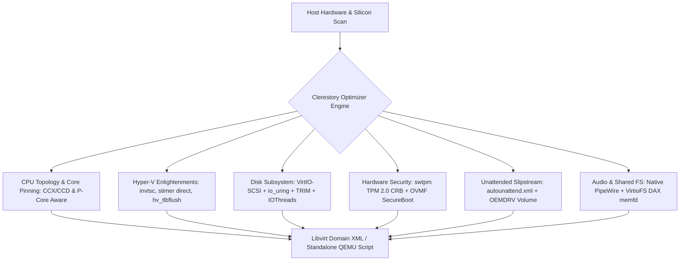

# Clerestory 🏛️

> **Hardware-Adaptive Windows 11 KVM Optimizer & Provisioning Engine**

[](https://github.com/developer/clerestory)
[](LICENSE)
[](https://www.rust-lang.org)

```
┌─────────────────────────────────────────────────────────────────────────────┐
│  CLERESTORY   Hardware-Adaptive Windows 11 KVM Optimizer                    │
├─────────────────────────────────────────────────────────────────────────────┤
│  • Sub-microsecond Invariant TSC & Hyper-V Enlightenments Suite             │
│  • Single-CCD & P-Core Cache-Aware Pinning (AMD Zen / Intel Hybrid)         │
│  • VirtIO-SCSI with io_uring, cache=none, and TRIM Thin-Provisioning       │
│  • In-Memory FAT32 OEMDRV Virtual Disk & Zero-Touch autounattend.xml        │
│  • Looking Glass (IVSHMEM) & Native Low-Latency PipeWire Audio (~10ms)      │
└─────────────────────────────────────────────────────────────────────────────┘
```

---

## Overview

Generic virtualization tools (`virt-manager`, `quickemu`, `gnome-boxes`) use one-size-fits-all defaults. On Windows 11, this leads to **60–75% of potential performance**, audio crackling, DPC latency spikes, micro-stutters, and manual driver partition roadblocks.

**Clerestory** is an opinionated, enterprise-grade systems optimizer built exclusively for Windows 11 on Linux KVM/QEMU. It inspects host silicon topology (L3 cache/CCD boundaries, SMT thread pairs, NUMA nodes, IOMMU groups, hugepages, audio latency buffers) and synthesizes near-bare-metal virtual machines with zero-touch automated driver slipstreaming.

---

## Architecture



---

## Key Capabilities

### 1. Silicon Topology & Cache Pinning
* **AMD Zen 3 / Zen 4 / Zen 5**: Isolates guest vCPUs within a single Core Complex Die (CCD) and L3 cache pool to eliminate the ~80ns cross-CCD Infinity Fabric latency penalty.
* **AMD 3D V-Cache Asymmetry**: Automatically detects 96MB V-Cache dies on Ryzen 7900X3D/7950X3D and offers `--profile gaming` (pins to 3D V-Cache) vs `--profile compute` (pins to high-frequency CCD).
* **Intel Hybrid P/E-Cores**: Overcomes KVM's lack of Intel Hardware Feedback Interface (HFI) virtualization by dedicating high-IPC P-cores to guest vCPUs and offloading QEMU emulator overhead to E-cores.

### 2. Hyper-V Enlightenments & Real-Time Clocks
Injects all 12 Hyper-V performance flags:
* `invtsc` + `tsc-deadline` (Invariant hardware TSC).
* `stimer direct=on` (Direct timer interrupts to APIC vectors).
* `frequencies state=on` (MSR clock crystal frequency passthrough).
* `tlbflush` + `ipi` (PV hypercall interrupt shootdowns).
* `hpet present='no'` (Eradicates slow MMIO VM-exits).

### 3. Asynchronous Storage & Zero-Touch Slipstream
* **VirtIO-SCSI**: Uses multi-queue (`queues=N`) with `io_uring`, `cache=none`, and `discard=unmap`.
* **In-Memory OEMDRV Disk**: Synthesizes a virtual FAT32 volume directly in memory containing `autounattend.xml` and VirtIO drivers, bypassing the Microsoft Account (MSA) requirement and silently installing the QEMU Guest Agent on first boot.

---

## Installation & Build

```bash
# Clone and build optimized release binary
git clone https://github.com/developer/clerestory.git
cd clerestory
cargo build --release

# Run test suite
cargo test --all-targets
```

---

## CLI Usage Guide

```bash
# 1. Inspect host hardware diagnostics
clerestory doctor

# 2. Provision optimized Windows 11 VM in one command
clerestory create \
  --iso /path/to/Win11_English_x64.iso \
  --name "win11-gaming" \
  --cores 8 \
  --ram 16384 \
  --disk 120 \
  --gpu-mode looking-glass \
  --share-dir ~/Projects \
  --username "ritesh"

# 3. Dry-run synthesis (view generated XML without touching disk)
clerestory create --name "win11-dry" --iso /dev/null --dry-run

# 4. Generate shell auto-completions
clerestory completions zsh > ~/.zfunc/_clerestory

# 5. Generate ROFF man pages
clerestory man --output-dir docs/man
```

---

## Professional Distribution Standards

* **POSIX Exit Codes**: Conforms to standard BSD/POSIX sysexits (0=OK, 2=Usage, 64=DataErr, 69=Unavailable, 74=IOErr).
* **NO_COLOR Support**: Automatically respects `NO_COLOR` and `CLICOLOR_FORCE` standards.
* **Machine-Readable JSON**: All inspection commands support `--json` for automated script pipelines.

---

## License

Dual-licensed under MIT or Apache-2.0.
